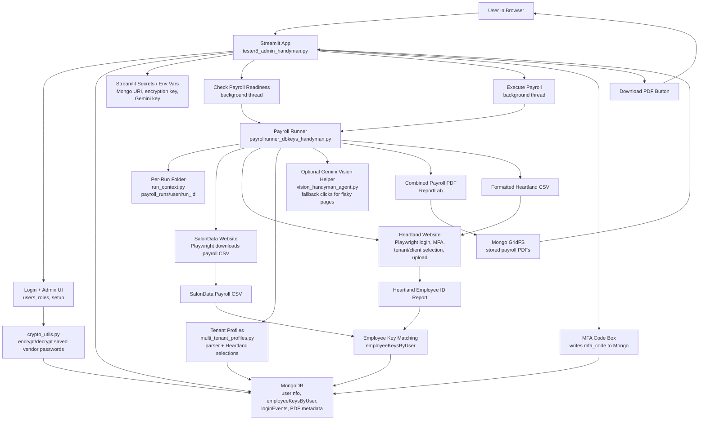

# Payroll App Architecture

## Simple System Diagram

If you paste this into Mermaid Live Editor, use `ARCHITECTURE.mmd` or copy only the lines between the code fences. Do not include the ```mermaid and ``` lines.



## Workflow In Plain English

1. The user opens the Streamlit app in the browser.
2. The app reads settings from `.streamlit/secrets.toml` or environment variables.
3. The user logs in. User records, roles, encrypted vendor credentials, MFA codes, and payroll status live in MongoDB.
4. The user can run **Check Payroll Readiness**.
   - First it downloads SalonData payroll data.
   - It compares employees against saved employee keys.
   - If keys are missing, it logs into Heartland to sync/download the Employee ID report.
   - If Heartland asks for MFA, the UI waits for the user to type the code.
5. The user can run **Execute Payroll**.
   - The backend starts a background thread.
   - Playwright opens SalonData and downloads the payroll CSV.
   - Playwright logs into Heartland, handles MFA, chooses the correct profile/client, and reaches the payroll area.
   - The runner builds a payroll PDF and formats a Heartland upload CSV.
   - The upload CSV is sent into Heartland.
6. The generated PDF is stored in Mongo GridFS and logged on the user document.
7. The Streamlit UI refreshes status and shows the latest PDF download button.

## Main Files

- `tester8_admin_handyman.py`: Streamlit app, login, admin page, readiness button, execute button, MFA input, PDF download.
- `payrollrunner_dbkeys_handyman.py`: Main backend automation and payroll processing.
- `multi_tenant_profiles.py`: Per-user Heartland profile/client choices and parser profile settings.
- `payroll_backend_bridge.py`: Small adapter connecting the runner to tenant profiles and run folders.
- `run_context.py`: Creates safe per-user, per-run folders.
- `crypto_utils.py`: Encrypts and decrypts saved vendor credentials.
- `mongo_helpers.py`: Shared MongoDB helpers.
- `gridfs_pdf_storage.py`: Stores generated PDFs in Mongo GridFS.
- `vision_handyman_agent.py`: Optional Gemini screenshot-based helper for flaky browser steps.
- `app_config.py`: Shared configuration from Streamlit secrets or environment variables.

## Data Stores

- `userInfo`: users, roles, encrypted credentials, payroll status, latest PDF metadata, MFA code.
- `employeeKeysByUser`: saved employee key mappings by user.
- `loginEvents`: login attempt history.
- `payroll_pdfs` GridFS bucket: generated payroll PDFs.

## External Systems

- **SalonData**: source payroll report CSV.
- **Heartland**: MFA, profile/client selection, Employee ID report, final payroll CSV upload.
- **Gemini API**: optional visual fallback when page selectors fail.
